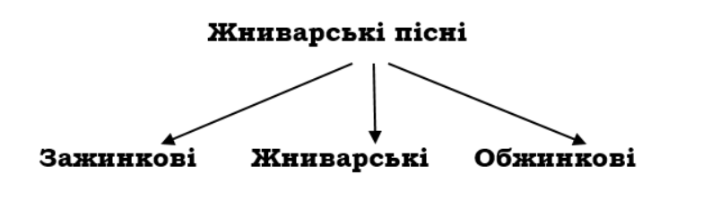

**Мета:** ознайомити учнів зі жниварськими піснями; розкрити їхню
магічну силу для наших предків;
формувати навички вираз­ного читання обрядових пісень; виховувати
повагу до прадавніх вірувань наших предків, повагу до
сільськогосподарської праці.

<!--more-->

**Обладнання:** збірки обрядових пісень;
 сніп колосся, вінки з квітів і колосся;
 ілюстра­тивний матеріал.

**Тип уроку**: бінарний урок (українська література і народо­знавство).

 **Епіграф**

Що за милозвучність та краса,

не кажучи вже про класичну простоту

та безпосередність натхнення!

Се джерело, з якого на здоров’я 

довго ще будуть пити нащадки.

П. Грабовський

## **
Хід уроку
**

### І. АКТУАЛІЗАЦІЯ ОПОРНИХ ЗНАНЬ УЧНІВ.

#### 1.  **Фронтальне опитування.**

- Який твір називають народною піснею?
- Яку пісенну поезію називають обрядовою?
- Назвіть пісні літнього календарного циклу.
- Які особливості русальних та купальських пісень?

#### 2.  **Виразне читання купальських пісень декількома учнями.**

### I.  ПОВІДОМЛЕННЯ ТЕМИ ТА МЕТИ УРОКУ.

"Яка пшениця, така паляниця", "Хліб - усьому голова", "Буде хліб -
буде й пісня" - такі прислів'я побутують здавна в нашого народу. Жнива - це своєрідний підсумок важкої і водночас радісної праці хлібороба.
Це було велике свято, до якого ретельно готувалися. І ось уже від
ранкової до вечірньої зорі кресали серпи, дзвеніли коси, рядками
лягали снопи, виростали копи збіжжя і звучали пісні.

Сьогодні на уроці ми ознайомимося із жниварськими обряда­ми та
піснями, що їх супроводжували, спробуємо збагнути загадковість творчої
душі наших предків.

### I.  ВИВЧЕННЯ НОВОГО МАТЕРІАЛУ.

#### **1. Пояснення вчителя.**

Зажинкові пісні бажали радісних і легких жнив, пророкували щедрий
урожай, співали хвалу першому снопові.

Власне жниварські пісні оспівували землю-годувальницю, сто­сунки між
господарями та женцями, у них прославлялися най­кращі женчики,
висміювалися ледарі, поетизувалася важка, проте мила серцю праця,
селянська доля.

Обжинкові пісні оспівували господаря та його сім'ю, бажали здоров'я й
достатку.

#### 2.  **Інсценізація "Зажинки".**

 *(Святково прибраний клас: стіл, застелений білою скатерти­ною, сніп
 колосся на покуті, на стінах вінки з квітів і колосся.)*

 ***Учитель.*** Починалися зажинки на Прокопа (21 липня). Крім того,
 вони мали збігатися з повним місяцем і так званими "легки­ми"
 (жіночими) днями - середою, п'ятницею, суботою.

 Надходила урочиста, сповнена радості і хвилювань мить, - за­жинки.
 Господиня, зодягнувшись у біле святкове вбрання, знімала з одвірка,
 переплетеного торішнім перевеслом, серпа, і, поклавши його в кошик, де
 вже лежали в хустині буханець хліба та дрібка солі, виходили в поле.
 На межі зупинялася, кланялася ниві.

 **Господиня.** Дай, Боже, час добрий і пору в доброму здоров'ї пожати
 та на той рік діждати!

 **Господар** *(ставав обличчям до сходу сонця й шанобливо знімав
 шапку).* Господи Боже, поможи легенько, добренько, щоб ви­жати
 хутенько!

 **Господиня.** Перший зажинок робився так: трьома захватами лівої руки
 стинали одну жменю, а потім другу. Зжаті стебла клали навхрест, і вони
 мали лежати до закінчення жнив. *(Імітує відповідні рухи.)*

 **Господар.** У деяких селах першу жменю відносили в комору, де вона
 стояла до Нового року. Напередодні Різдва її вносили до світлиці, щоб
 поворожити на багатий урожай.

 ***Учитель.*** Отже, жнива розпочалися. Тут відразу тихо зринала
 пісня, линула над нивами й завмирала в синій далині.

 **Учні виконують пісню "За горою, за крутою...", імітуючи рухи
 женців:**

 
За горою, за крутою

 
Росте жито з лободою.

 
Там дівчина жито жала,

 
У правій руці серп держала, *(Двічі)*

 
А лівою підбирала, *(Двічі)*

 
Назад себе жменьки клала. *(Двічі)*

 
Ой граю, граю канарею,

 
Вернулася - позбирала *(Двічі)*

 
Да в снопочки пов'язала, *(Двічі)*

 
Да в кіпочки поскладала.

 
Ой граю, граю канарею,

 
Да в снопочки поскладала.

 **Господиня.** Вижате за день збіжжя пов'язували в сніпки. Перший сніп - "коляда", "воєвода", "зажинок" - мав неабияке зна­чення.

 **Господар.** Якщо в родині була дівчина на виданні, то з "воє­води"
 пекли коровай на весілля і прикрашали його колосками.

 Коли в цьому не було потреби, перший сніп ставили на покуті, де він
 зберігався до початку осінньої сівби. Із розім'ятих колосочків робили
 перший засів.

 ***Учитель.*** Такими магічними діями й віщим словом прагнули
 задобрити таємничі сили природи, щоб, зажавши в "добрий час", щасливо
 завершити жнива.

 **Виразне читання зажинкової пісні "Поможи нам, Боже, ниву пожати".**

 
Поможи нам, Боже, ниву пожати,

 
Ниву пожати, у копи скласти,

 
У копи скласти, копи повозити,

 
Копи повозити з поля до обори,

 
З обори до стодоли, зі стодоли до комори,

 
З золотої ниви в щасливу годину!

#### 4.  **Інтерв'ю "Жниварські пісні".**

 **Журналіст.** Жнива тривали від зорі до зорі. Женці йшли в поле й
 поверталися додому з піснями. Чому?

 **Етнограф.** Спів звеселяв душу, знімав утому, додавав снаги.

 **Журналіст**. Яким настроєм сповнені жниварські пісні?

 **Етнограф.** У них звучить хліборобська гордість за щедрі пло­ди
 своєї праці, мрія про добробут, любов до рідної землі, похвала ниві,
 врожаєві, сонцю, господарям-трудівникам.

 **Журналіст.** Проте жнива - це важка праця, втома до сьомого поту. Чи
 йдеться про це у жниварських піснях?

 **Етнограф.** Олексій Дей зазначає: "Жнивні пісні ніби скупані и
 золотому промені літнього сонця, образ якого в них незмінно присутній,
 вони дихають теплом і свіжістю зоряних вечорів, ароматом поля,
 достиглої та свіжозжатої пшениці. Навіть мотиви втоми женців від
 важкої праці під спекотним сонцем втілені в світлих об­разах, що
 виграють іскрами надій на відпочинок, радість, молодечі зустрічі на
 щастя..."

#### **5. Виразне читання пісні "Там у полі криниченька".**

 
Там у полі криниченька,

 
Навколо пшениченька.

 
Там женчики жали,

 
Золоті серпи мали,

 
Срібнії юрочки,

 
Що в'язали снопочки.

 
Добрії були женці –

 
Дівчата й молодиці.

 
Дівчата - косаті,

 
А хлопці - вусаті,

 
Молодиці — білолиці.

#### **6. Виразне читання пісні "Ой вже сонце котиться".**

 
Ой ,вже сонце котиться,

 
Нам обідать хочеться.

 
Ой, дай, пане, дай

 
Обідати нам!

 
Як обідать не даси,

 
То вже завтра не проси.

 
Як прийдеш прохати -

 
Кочергою з хати.

 
На завтрашній день

 
Підемо до людей.

 
Та в чужого ж пана

 
Горілочку п'ють,

 
В нашого, скупого,

 
Й води не дають.

 
У чужого пана

 
їдять калачі,

 
У нашого, скупого,

 
Ще й хліб у печі.

#### **7. Виразне читання пісні «Маяло житечко, маяло».**

 
Маяло житечко, маяло,

 
Як у полі стояло,

 
А тепер не буде маяти,

 
А буде в стодолі лежати.

 
До межі, женчики, до межі,

 
Бо мої пиріжечки у діжі.

 
До краю, женчики, до краю,

 
То я вам пиріжечки покраю.

 
Котився віночок по полю,

 
Просився у женчиків додому:

 
Возьміте мене, женчики, з собою

 
Та занесіте мене до господаря в стодолу,

 
Бо я вже в чистім полі набувся,

 
Буйного вітречку начувся,

 
Од ясного сонечка нагрівся,

 
А дрібного дощику напився;

 
Нехай же я у стодолі одпочину,

 
Поки вивезуть знов на ниву.

#### **8. Бесіда.**

-   До якого виду жниварських пісень (зажинкові, жнивні, обжинкові)
    належать прочитані вами тексти?
-   Кого славить народ у жниварських піснях?
- Назвіть епітети в першій пісні. Яка їх роль у творі?
- З яких рядків зрозуміло, що герої пісень "добрії женці"?
- Які слова в піснях є пестливими? Про що вони свідчать?
- Чи може людина від важкої праці переживати радість і за­доволення?

*Учитель. ***У жниварській пісні «Маяло житечко, маяло» віночок
зображений не як звичайний предмет, а як жива істота. Він розмовляє із
женцями, просить занести його в стодолу, де зможе відпочити, аж поки
його знову винесуть на ниву.

 Надання тваринам, рослинам, предметам і явищам людських властивостей
 називається ***персоніфікацією.***

 Цей прийом найчастіше використовують у таких фольклорних жанрах, як
 казки, байки і легенди.

#### **9. Інсценізація "Сніп-Рай".**

 ***Учитель.*** Після закінчення жнив робили Сніп-Рай та обжин­ковий
 вінок.

 **Дівчата** *(співають).*

 
Наш пан молоденький,

 
Під ним коник вороненький,

 
По полю проїжджає,

 
Женчиків виглядає:

 
- Чи не йдуть мої женці,

 
Чи не несуть вінка в руці?

 
Аж їдуть женці з лану,

 
Несуть віночок пану.

 **1 дівчина.** А що то - Сніп-Рай? Як виготовляли його?

 **2 дівчина**. Чоловіки й жінки проходили по ниві вздовж і
 впоперек, збирали колоски й складали у "квітку", "китицю", у невеликй
 "Сніп-Рай" чи плели волосяний хрест.

 **3 дівчина.** Мені бабуся розповідала, що цей Сніп-Рай і ємісцем
 перебування душ померлих, добрих духів поля. У цьому Раю оселяється й
 сам дух урожаю, що сходить невидимо з неба в дні Корочуна та на Новий
 рік. Цей бог призначає духів-опікунів на охорону ниви. 

 **4 дівчина.** А що то - Корочун?

 ***Учитель.*** Що це за свято, наука з'ясувала мало. Дослідники
 стверджують, що Корочун - це свято Коляди. Про нього згадується
 Іпатіївському літописі 1202 р. У XII ст. про Корочуна згадує й
 Новгородський літопис, але як про загальну назву.

 На Закарпатті корочун - великий білий коровай, різдвяна па­ляниця.
 Саме слово "корочун" пояснюється так: або це найкоротший день року,
 або що це день "покрочував", почав довшати, а то виводять з
 румунського "сгасіші" - Різдво.

 **1 хлопчик.** А я знаю, що Сніп-Рай ставили на найпочеснішому місці в
 хаті - на покуті. Вірили, що в ньому витає дух померлих мни-прадідів -
 Ладо, опікунів роду.

 **5 дівчина.** Ось і готовий наш Сніп-Рай. Час княгиню виби­рати.

 *Та стає в середину кола, схиляє голову перед женцями. Найширший жнець
 підперізує* її *перевеслом із колосся й урочисто кладе їй на голову
 віночок.)*

 **2 хлопчик.** Господар з господинею в поході зі Снопом-Раєм участі не
 беруть. Вони раніше йдуть з ниви, щоб урочисто зустріти м ушанувати
 Сніп-Рай, вінок та женців.

 *(Виконання пісні або виразне читання.)*

 
Ой котився вінок по полю

 
Да й просився до господаря додому:

 
— Пусти мене, господарю, в комору,

 
Нехай я в коморі відпочину,

 
То я піду на зиму на ниву.

 
Як ти мене, господарю, ізбережеш,

 
То багатії урожаї ізбереш,

 
Із одного мого колосочка

 
Та й виросте житечка повна бочка.

 
Ой до кінця, женчики, до кінця

 
Та й підемо додомоньку за сонця!

 **Господиня.** Я поприбирала в хаті, замела подвір'я, господар же
 прибрав стодолу. Стіл застелила білою скатертиною, лавки -рушниками,
 на покуті розстелила білий рушник, на ньому постави­ла свячену воду і
 хліб-сіль.

 **Господар.** А я тим часом перед ворітьми на подвір'ї поставив стіл,
 на ньому хліб-сіль і горілку. Ось і женчики зі Снопом-Раєм!

 **Господиня.** Дякуємо вам за працю, за Сніп-Рай та вінок. Заходьте,
 женчики, до хати!

 **Княгиня.** Щастя, добра, достатку, миру вашій хаті!

 *(Два женці-чоловіки знімають вінок з княгині і закладають його на
 голову господареві. Старші женці вручають йому Сніп-Рай. Господар
 знову дякує женцям.)*

 **Хлопчик.** Вінок чіпляють на образах, а Сніп-Рай ставлять на покуті,
 а під ним хліб-сіль, воду, мед чи горілку.

 *(Учні співають пісню, яка була завершальним акордом обжин­кового
 циклу.)*

 
Ой вип'ємо, родино,

 
Щоб нам жито родило,

 
І житечко, і овес,

 
Щоб зібрався рід наш увесь,

 
І пшениця, і ячмінь,

 
Щоб нам життя було смачніш!

#### **10. Слово вчителя.**

 Ми дуже завинили перед своєю історією, коли свідомо відріка­лися від
 мудрого досвіду своїх пращурів. Та через століття проби­вається до нас
 чисте джерело жниварської поезії. Воно й зараз повгамовує наші душі.
 Адже за всіх часів жнива були й залишаються найбільшою святістю, нашим
 добробутом, означеним не лише ма­теріальними статками, а й духовною
 потребою, бо хліб, як каже народна мудрість, - усьому голова.

### IV.  ПІДБИТТЯ ПІДСУМКІВ УРОКУ.

1.  Які жниварські пісні ви знаєте?
2.  Які пісні вам сподобались і чому?

### V. ДОМАШНЄ ЗАВДАННЯ

 Записати від своїх рідних і знайомих жниварські пісні. Нама­лювати до
 них ілюстрації.
